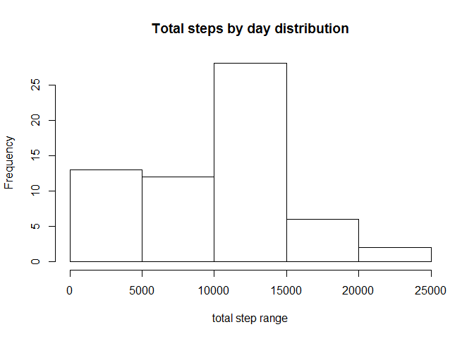
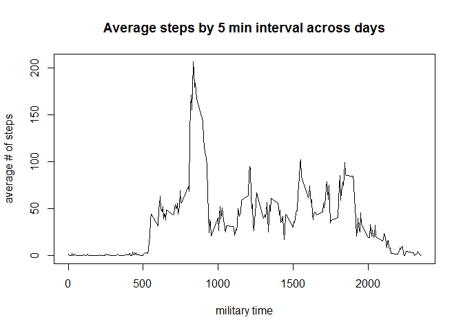
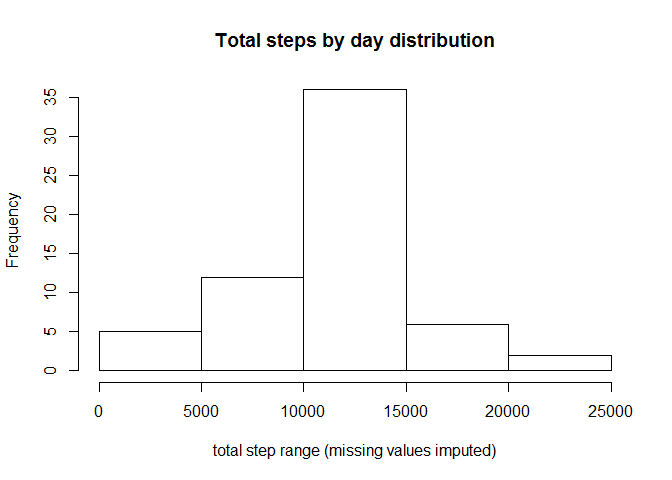
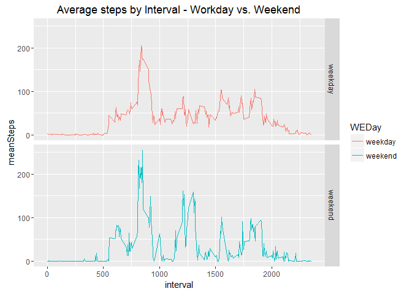

# Reproducible_Research_Assg1
John R Sullivan  
August 9, 2016  

This is an R Markdown document. Markdown is a simple formatting syntax for authoring HTML, PDF, and MS Word documents. For more details on using R Markdown see <http://rmarkdown.rstudio.com>.


Chunk1 - Housekeeping

```r
library("ggplot2");library(dplyr); library(knitr)## detach(package:plyr)
```

```
## 
## Attaching package: 'dplyr'
```

```
## The following objects are masked from 'package:stats':
## 
##     filter, lag
```

```
## The following objects are masked from 'package:base':
## 
##     intersect, setdiff, setequal, union
```

```r
setwd("~/Data Science Courses/Data/RepRsrchA1")

activdata <- read.csv("activity.csv",header=TRUE,stringsAsFactors = FALSE)
```

Chunk2 - plot total, mean, median daily steps 

```r
## Calculate daily step total
activdata$date <- as.character(activdata$date)
 daytot <- activdata %>%
      group_by(date) %>%
      summarise(totsteps = sum(steps,na.rm=TRUE))

## plot daily step histogram
hist(daytot$totsteps,main="Total steps by day distribution",
     xlab="total step range") 
```



```r
## calculate mean and median
mean(daytot$totsteps)
```

```
## [1] 9354.23
```

```r
median(daytot$totsteps)
```

```
## [1] 10395
```
Chunk3 - plot average steps by 5 minute time interval

```r
## Calculate daily step total
activdata$date <- as.character(activdata$date)

 intmean <- activdata %>%
      group_by(interval) %>%
      summarise(avgsteps = mean(steps,na.rm=TRUE))

## plot steps by 5 minute interval
plot(intmean$interval,intmean$avgsteps,type="l",
     main="Average steps by 5 min interval across days",
     xlab="military time",ylab="average # of steps") 
```



```r
## determine max average step number
maxsteps <- max(intmean$avgsteps)

## identify interval with maximum steps
intmean$interval[intmean$avgsteps==maxsteps]
```

```
## [1] 835
```

Chunk4 - imputing missing step values

```r
## number of rows with NA's
 sum(!complete.cases(activdata))
```

```
## [1] 2304
```

```r
 activdata2 <- activdata

 ## replace NA step values with mean steps for that interval across days
      for (i in 1:nrow(activdata2)) {
       if (is.na(activdata2$steps[i])) {
            activdata2$steps[i] <-
                  intmean$avgsteps[intmean$interval==activdata2$interval[i]] 
                                    }
                                             }

 ## Calculate daily step total
 activdata2$date <- as.character(activdata2$date)
  daytot2 <- activdata2 %>%
      group_by(date) %>%
      summarise(totsteps = sum(steps,na.rm=TRUE))

## plot daily step histogram
 hist(daytot2$totsteps,main="Total steps by day distribution",
      xlab="total step range (missing values imputed)") 
```



```r
## calculate mean and median
 mean(daytot2$totsteps)
```

```
## [1] 10766.19
```

```r
 median(daytot2$totsteps)
```

```
## [1] 10766.19
```

```r
## Totstep values are significantly increased with day step totals more normally
## distributed when NA values for steps are imputed with mean value for interval 
## Median and mean of distribution are now equal
```


Chunk5 - weekdays vs. weekends

```r
 activdata2$date <- as.Date(activdata2$date)
 activdata2$WEDay <- "weekday"
 activdata2$WEDay[weekdays(activdata2$date)=="Saturday"|
                        weekdays(activdata2$date)=="Sunday"]  <- "weekend"
 activdata2$WEDay <- as.factor(activdata2$WEDay)
 
 ## Calculate mean by intervals and weekday/weekend
 activMean<- group_by(activdata2,WEDay, interval) %>%
             summarize(meanSteps = mean(steps))
 
 ## Plot average steps per interval for weekday/weekend
 g <-  ggplot(activMean,aes(interval,meanSteps)) 
    g +   geom_line(aes(color=WEDay)) +
        facet_grid(WEDay~.) + 
        labs(title="Average steps by Interval - Workday vs. Weekend")
```


